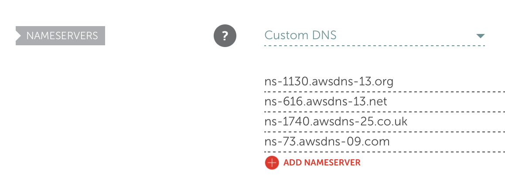
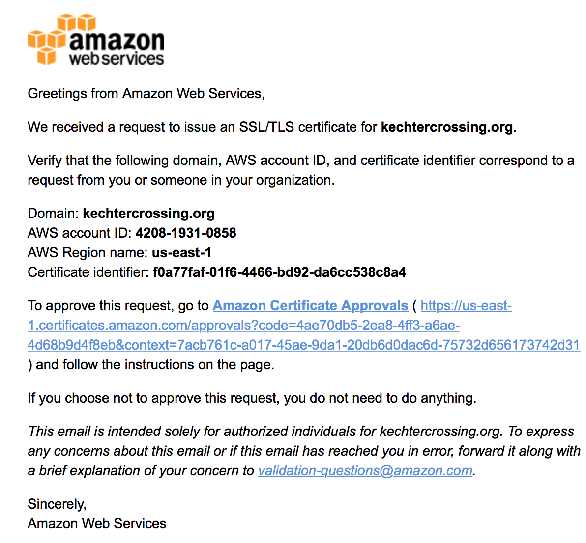

# Description

It's possible to host static assets using AWS tooling over SSL mostly for free.  This is an AWS
CloudFormation template and small script to help you setup web hosting for a SPA (single page app)
or any other sort of static website which has an `index.html` file.

Read below to get started and to learn more about how it works.

At the end of all this, you will end up with:

- a static website using your own domain
- a static website which automatially redirects `http` to `https` for your domain
- an s3 bucket which serves the website files
- a CloudFront distribution which caches assets for 2 minutes (configurable)
- (optionally) a website which works with or without `www` subdomain (default is without)

# Prerequisites

- A shell (tested on `bash` on OS X)
- [AWS Command Line Interface](https://aws.amazon.com/cli/)
- AWS credentials with enough privleges (admin privleges are the easiest)
- A domain name which you control and which is using Route53 for DNS

# Getting started

After the `aws` cli is installed and
[configured with your AWS keys](http://docs.aws.amazon.com/cli/latest/userguide/cli-chap-getting-started.html)
there are a couple of other things to check off the list in order for this to work:

## Using Route53

This setup only works when the DNS for your domain is controlled using Route53.  Changing this
isn't difficult but instructions will vary depending on your registrar.

If you don't already have a Hosted Zone setup in Route53 for your domain, do the following:

- Open [Route53 in the AWS console](https://console.aws.amazon.com/route53/home)
- Click 'Create Hosted Zone'
- Enter your domain name
- Ensure 'Type' is set to 'Public Hosted Zone'
- Click save
- Copy the newly created `NS` records to your registrar (example shown below when using Namecheap)

You can also create the `HostedZone` from the command line:

    $ aws route53 create-hosted-zone --caller-reference `uuidgen` --name roasterslog.com
    $ {
        "HostedZone": {
            "ResourceRecordSetCount": 2,
            "CallerReference": "A5D5BCC2-553A-4220-A191-89494A4E6932",
            "Config": {
                "PrivateZone": false
            },
            "Id": "/hostedzone/ZNLTFY0M31Q42",
            "Name": "roasterslog.com."
        },
        "DelegationSet": {
            "NameServers": [
                "ns-830.awsdns-39.net",
                "ns-1644.awsdns-13.co.uk",
                "ns-1339.awsdns-39.org",
                "ns-62.awsdns-07.com"
            ]
        },
        "Location": "https://route53.amazonaws.com/2013-04-01/hostedzone/ZNLTFY0M31Q42",
        "ChangeInfo": {
            "Status": "PENDING",
            "SubmittedAt": "2017-07-12T18:25:47.077Z",
            "Id": "/change/C2U9HS0R51XGBD"
        }
    }
    $ aws route53 get-hosted-zone --id ZNLTFY0M31Q42
    $ {
        "HostedZone": {
            "ResourceRecordSetCount": 2,
            "CallerReference": "A5D5BCC2-553A-4220-A191-89494A4E6932",
            "Config": {
                "PrivateZone": false
            },
            "Id": "/hostedzone/ZNLTFY0M31Q42",
            "Name": "roasterslog.com."
        },
        "DelegationSet": {
            "NameServers": [
                "ns-23423.awsdns-39.net",
                "ns-23423.awsdns-13.co.uk",
                "ns-2422.awsdns-39.org",
                "ns-23.awsdns-07.com"
            ]
        }
    }

## Setting up email

This stack will automatically setup a free SSL certificate for your domain and configure the
distribution such that everything is redirected from `http` to `https`. To verify domain ownership,
AWS will [send emails to various email addresses for your domain.](http://docs.aws.amazon.com/acm/latest/userguide/gs-acm-validate.html)
As such, you will need to have valid MX records and an email provider set up and working. Setting
that up is outside the scope of this stack, but there are plenty of resources which describe how
to do that.

A couple of things which I have done for testing or new domains without full-blown email:

- Use [Zoho Mail](https://mail.zoho.com/)
- Set up SES to [receive mail](http://docs.aws.amazon.com/ses/latest/DeveloperGuide/receiving-email-getting-started.html)

# Running

## Create your stack

    ./manage-stack.sh create --domain roasterslog.com --zone-id ZNLTFY0M31Q42 --name roasterslog

*Note: Initial create can take several minutes and requires you to check your email*

Immediately after launching this, check your email. You should receive an email with a link...click
it:

Once you've validated your domain, log into the 
[CloudFormation console](https://console.aws.amazon.com/cloudformation/home?region=us-east-1]) to watch the stack progress.
Again, note that stack creation will take several minutes mainly due to the CloudFront distribution
which is created.

## Uploading content

After your stack is created you will have a single page app over https with no content. You can get
your content there by uploading it into the S3 bucket which is creted for you.

    ./manage-stack.sh describe  --name roasterslog

Look at the `BucketName` output.

Alternately, look at the  `Outputs` section in the CloudFormation console so get the S3 bucket which was created.

You can now upload your content via several mechanisms.

*Note:* The only file required is an `index.html` file.

From the command line:

    $ cd some/directory/
    $ aws s3 cp . s3://roasterslog-s3bucketforstaticcontent-1npb6b9p4h41r/ --recursive --acl public-read

## Updating your stack

If you ever make changes to your stack, run the same command but replace `create` with `update`:

## Deleting your stack

- Delete any uploaded files in the S3 bucket
- From CloudFormation console, select your stack then `Actions -> Delete stack`
